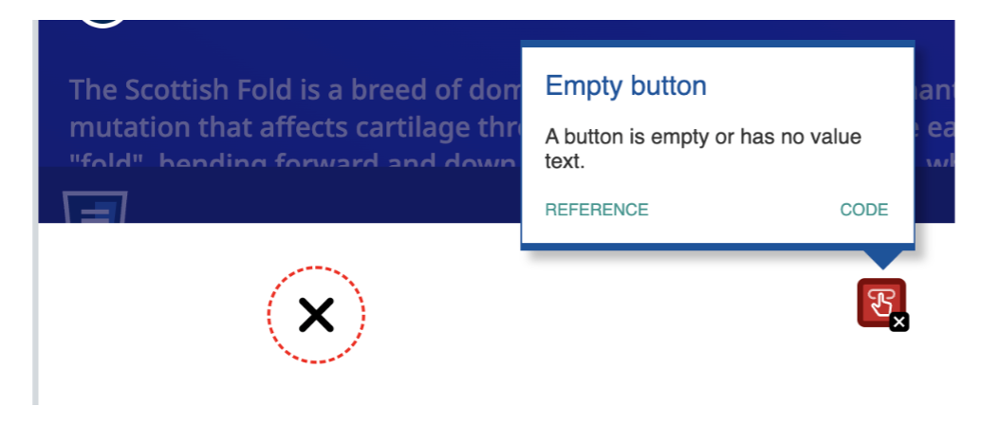

## Code Review Example

### Issue #1: Accessibility

The issue, why this is an issue, and the solution:

The accessibility issue is the "empty button" issue, meaning that the button is either empty or has no value text. A button should also have a value. However sometimes, we might use a glyphicon such as "x" to indicate this button is meant to close the popup modal. To fix this issue, we can add an "aria-label" attribute. It's also a good idea to add the "title" attribute, which will show the "title" of the image as a tooltip when the user hovers over the image.



Initial code:

```html
<button class="close-popup-button">
  <i class="fa-solid fa-xmark"></i>
</button>
```

Updated code:

```html
<button
  class="close-popup-button"
  title="close popup button"
  aria-label="close popup button">
  <i class="fa-solid fa-xmark"></i>
</button>
```
